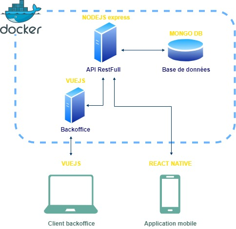

# Architecture du projet

## Architecture évolutive basée sur du Docker.
Elle comprend les conteneurs Docker suivants : 
*  Un conteneur avec une image NodeJS qui abritera l'API REST centrale utilisant le framework Express
*  Un conteneur avec une image Mongo qui abritera la base de données nosql
*  Un conteneur avec une image NodeJS qui abritera le backOffice en VueJS
*  Un conteneur avec une image Traefic qui permet un mapping de port entre tous les conteneurs sus décrits.

## Choix des technologies
Les choix suivants sont principalement basés sur la bonne connaissance du javascript par les membres de l'équipe. Ils tiennent également compte des performances des différentes technologies et librairies et de leur robustesse.

### ExpressJS
ExpressJs est un framework NodeJS permettant de créer des API REST. 

### Colyseus
Colyseus est une librairie permettant de créer des jeux multijoueurs en temps réel ou au tour par tour.

### MongoDB
Base de donnée noSQL.

### React-Native
Librairie permettant de créer, en javascript, des applications mobiles cross-platform tout en fournissant des performances très proche des langages natifs.

### VueJS
Framework javacript permettant de créer des applications web. 

### Docker 
Outil permettant de lancer des applications dans des conteneurs logiciels. Fournit des environnements commun et montables facilement.

### Jest
Librairie permettant l'implémentation de tests. Il est utilisé ici pour la réalisation de tests unitaires sur l'API.

